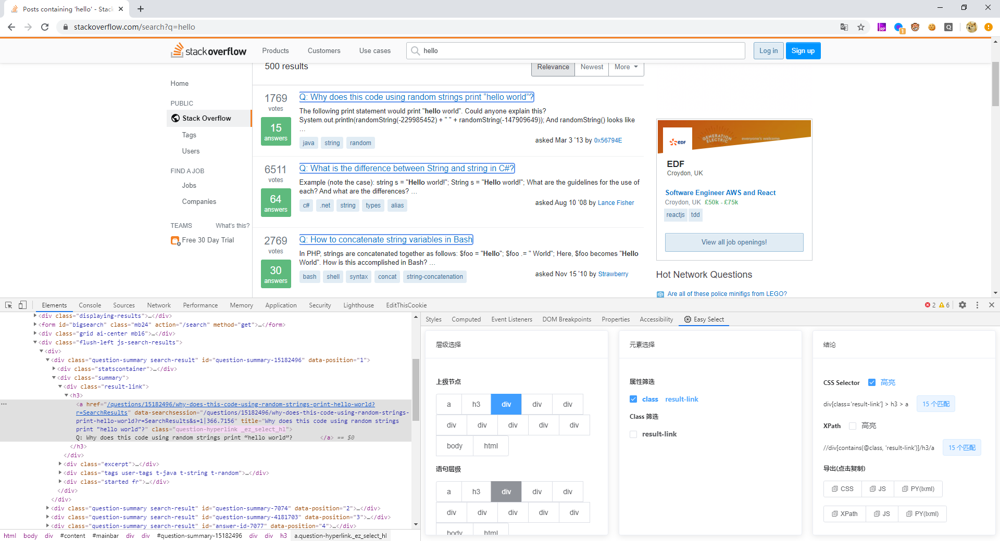

# Easy Select



一个用于快速生成 CSS 选择器的Chrome扩展。

这个工具可以让你在每一个这样的场景，省去几十秒到几分钟的时间。

适用于学习前端、自动化测试环境。


## 安装

Chrome扩展商店：https://chrome.google.com/webstore/detail/easy-select/emfpfmjldkffpibmfhdfmjdbkphccaom/related?hl=zh-CN

或从release手动安装

## 使用


首先，在浏览器中使用检查元素呼出调试工具，然后用inspector选择一个元素。

在右侧的面板选择一下“Easy Select”就能看到工具界面了。

界面分三个部分：

### 1. 层级选择面板

CSS选择器通常通过上级元素来进行辅助定位，例如：

```
div.items > article > a.title
```

最高是到html元素这一级，如果你不小心点多了，生成出的表达式会很长，可以使用第二排限制最终表达式的长度。


### 2. 元素选择面板

这个就是通过选择class还有元素属性构造选择器了。这个面板与层级选择面板是联动关系。

### 3. 结论面板

这里可以看到最终生成的表达式，当前页面的表达式匹配元素数量。

还可以进行高亮，以及最下面的表达式 / 语句复制。


## 开发
```
npm install # 安装环境
npm run serve # 编译并热更新
npm run build # 生产环境打包
npm run analyze # 分析包组件大小
```

### 响应号召，出摊摆碗


